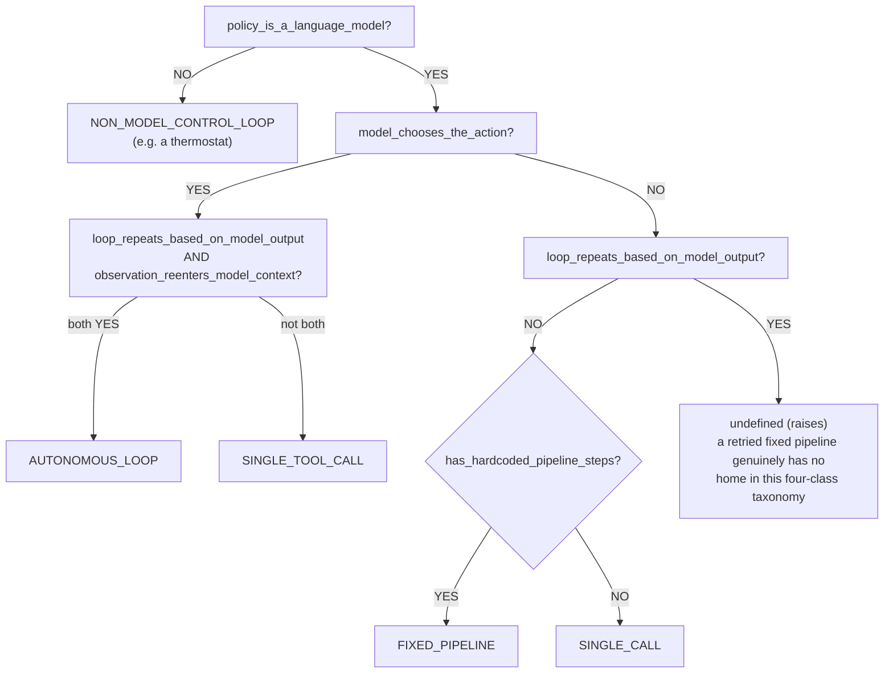

# Agent Loop — One-Page Reference

*Chapter 1 deliverable: definitions of the agent loop and its vocabulary.*

## The definition

> An **agent** is a **loop** that couples a **model** to an **environment**
> through **actions** and **observations**, where the model's own prior
> output determines its next input.

"Agent" names the loop's shape *and* the fact that a model fills the policy
role — not any individual tool call, not a name like "agentic X," and not
the mere presence of a feedback loop (see the thermostat case below).

## The decision procedure

Five yes/no structural predicates, answered from a system's actual wiring —
never from its name — determine its class:

1. **`policy_is_a_language_model`** — is a model choosing, not a fixed rule?
   Checked first; if false, nothing below matters (see thermostat).
2. **`has_hardcoded_pipeline_steps`** — are there engineer-fixed stages
   independent of the model?
3. **`model_chooses_the_action`** — does the model pick WHICH action
   happens, vs. the action being predetermined?
4. **`loop_repeats_based_on_model_output`** — does whether/how the system
   continues depend on the model's own prior output?
5. **`observation_reenters_model_context`** — does the action's result come
   back to the SAME model, before its next call?

## Two boundary cases that justify the predicates

**"Agentic RAG" vs. a RAG pipeline.** A RAG system where the model decides
each turn whether to retrieve again has *identical* loop-shape predicates to
a coding agent — both `AUTONOMOUS_LOOP` — despite "RAG" usually meaning
`FIXED_PIPELINE` (a hardcoded embed→retrieve→generate sequence with no
per-turn model choice). The predicates read structure, never the name.

**A thermostat.** Measure temperature → compare to setpoint → heat on/off →
repeat, forever, each cycle conditioned on the last. Every loop-shape
predicate this taxonomy checks (`model_chooses_the_action`,
`loop_repeats_based_on_model_output`, `observation_reenters_model_context`)
is satisfied — structurally indistinguishable from a coding agent's
reason-act-observe cycle. It's excluded from the spectrum entirely (its own
`NON_MODEL_CONTROL_LOOP` bucket, not `SINGLE_CALL`) purely because
`policy_is_a_language_model` is false. **Lesson:** a closed feedback loop
alone — control theory's oldest idea — is not sufficient for "agent" here.
The model-as-policy requirement is load-bearing, not decoration.

## Action and observation

- **Action** — the unit of model output the loop treats as "do something,"
  as opposed to a final answer meant for a human.
- **Observation** — whatever the environment returns after an action runs,
  appended to context so it's visible on the model's *next* call. This
  feedback path is exactly `observation_reenters_model_context`, predicate
  5 above — it is the mechanical core of what makes a loop a loop.

## The controller view

Treat the model as a policy `pi(context) -> action`. What distinguishes an
agent is whether `pi`'s own output feeds back into `pi`'s own future
input — predicates 4 and 5 together, not model capability or prompt quality.

## Common misconceptions

- **"An agent is just a prompt."** A prompt shapes one call; none of the
  five predicates are about prompt content.
- **"A feedback loop makes something an agent."** The thermostat satisfies
  every loop-shape predicate and still isn't one — see above.
- **"A name like 'agentic X' is evidence."** The predicates never read a
  system's name; a "RAG" system landed in `AUTONOMOUS_LOOP` above precisely
  because the check ignores the label.
- **"Every system fits one of the four classes."** It doesn't — a fixed
  pipeline retried on failure (steps hardcoded, but the retry loop feeds
  itself the failure as feedback) satisfies predicate 4 and 5 without
  predicate 3, a combination this taxonomy deliberately raises on rather
  than force-fitting.

## Where code execution fits

Code is one specific **action space** (Chapter 2) — the vocabulary of
actions the model in an `AUTONOMOUS_LOOP` system is allowed to emit. This
guide's central claim, developed from Chapter 2 onward, is that executable
code is an unusually good action space for that loop specifically because
of what it does to predicate 5's feedback path: a code interpreter's
output (stdout, return values, tracebacks) is an unusually rich, structured
observation to feed back in.
