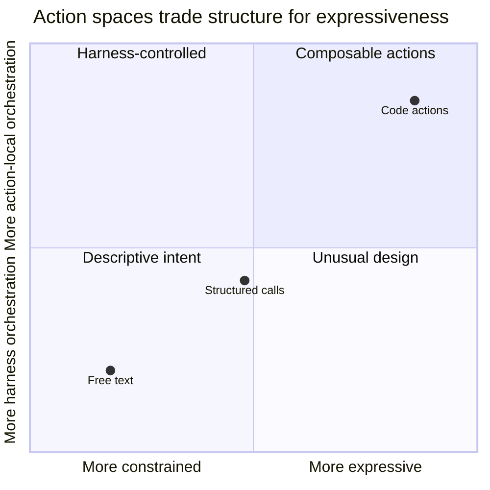
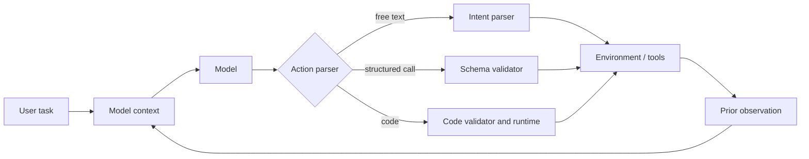

# Chapter 2 — Action Spaces: Text, JSON, and Code

Suppose an agent must read several files, add the numbers inside them, and
write the result. What should the model produce next?

It could describe the action:

> Read `f0.txt`, then read `f1.txt`, add the values, and save the sum.

It could request one predefined tool:

```json
{"tool": "read_file", "arguments": {"path": "f0.txt"}}
```

Or it could emit a small program:

```python
total = sum(int(read_file(f"f{i}.txt")) for i in range(2))
write_file("total.txt", str(total))
```

All three responses express intent. They do not, however, give the agent the
same precision, composability, or failure surface.

## 1. Concept

An **action space** is the set of actions an agent is permitted to express,
together with the format used to express them.

This chapter compares three common action spaces:

1. **Free text** — the model describes what should happen in natural language.
2. **Structured tool calls** — the model selects a predefined operation and
   supplies schema-checked arguments, commonly represented as JSON.
3. **Code actions** — the model writes a program that can call tools, transform
   data, and use control flow inside one action.

These are design choices, not a ladder of maturity. A code action is more
expressive, but greater expressiveness also creates more ways to fail and a
larger surface to validate. The best action space is the narrowest one that
still expresses the task well.

> **Learning goal:** Choose an action space by reasoning about composition,
> validation, round trips, observability, and risk—not by assuming that one
> format always wins.

## 2. Why This Matters for Code-Executing Agents

The action space determines where orchestration happens.

- With free text, a parser or a human must translate prose into operations.
- With structured calls, the model selects operations but the agent harness
  usually coordinates each call and returns its result.
- With code, some orchestration moves into the generated action itself.

That placement affects the entire system: model turns, context size, data flow,
error handling, approval boundaries, and observability. A narrow schema can
force a multi-step task through many model round trips. An unrestricted
programming language can be excessive for a single sensitive operation that
would be clearer as one validated tool call.

## 3. Mental Model

Think of an action space as a language available to the model. Languages differ
along two independent axes:

- **Orchestration:** Who decides what happens between operations—the model on a
  later turn, the harness, or the current action?
- **Compression:** Can repeated operations be represented by a loop or reusable
  function, or must each operation be written separately?



The positions are conceptual, not measurements. Structured APIs may support
multiple or parallel calls in one response, and a code-action system may
deliberately restrict the available language.

### Bundling is not the same as compression

Code can reduce turns in two different ways:

- **Bundling:** Put several distinct operations in one executable action.
- **Compression:** Represent many similar operations with a loop or function.

A heterogeneous task can still be bundled, but it may not compress. Keeping
these mechanisms separate prevents claims such as “code is always 90×
cheaper.”

## 4. Architecture (place in the loop / context)

The action space defines the contract between the model and the executor.



The loop is similar in all three cases:

1. The model sees the task and prior observations.
2. It emits an action in the permitted format.
3. The harness parses and validates the action.
4. The environment executes it.
5. The result returns as an observation.

What changes is how much work one trip around the loop can express. Containing
untrusted execution belongs to the sibling sandboxing guide; here we focus on
the agent-side contract and behavior.

## 5. Detailed Explanation

### 5.1 Free-text actions

Free text is easy for a model to produce and a person to read:

> Open the customer file and check the latest balance.

Ambiguity appears when software must execute it. Does “customer file” identify
one path? Does “check” mean read, validate, or compare? A downstream parser
must infer both operation and arguments.

This chapter includes a simple first-pass parser: two intent keywords (`read`,
`open`) and a filename regular expression. Across eight handwritten variations,
it extracts four correctly, misses three, and silently extracts the wrong path
once.

That **4/8 result is a demonstration set, not a benchmark**. The examples are
not randomly sampled and the parser is intentionally small. Its value is
diagnostic: it exposes two qualitatively different failures.

- **Missed intent:** no action is produced, so the harness can ask again.
- **Wrong extraction:** a valid-looking but incorrect action is produced.

Free text still has legitimate uses: conversation, human-reviewed plans, and
domains where actions cannot be enumerated in advance. It becomes fragile when
prose is treated as a machine protocol without a strong parser, grammar, or
validation layer.

### 5.2 Structured tool calls

A structured call makes the operation explicit:

```json
{
  "tool": "read_file",
  "arguments": {"path": "f0.txt"}
}
```

A simplified schema might look like this:

```json
{
  "name": "read_file",
  "description": "Read a text file in the workspace.",
  "parameters": {
    "type": "object",
    "properties": {"path": {"type": "string"}},
    "required": ["path"],
    "additionalProperties": false
  }
}
```

The harness can validate the tool name and argument shape before execution.
Schemas constrain **shape**, not **meaning**: the string may still name the
wrong file, and a valid call may still be inappropriate. Semantic checks,
authorization, and postconditions remain necessary.

Structured calling does not literally have “no control flow.” Modern APIs may
allow more than one call in a response, including independent calls that can
run in parallel. The narrower limitation is that ordinary tool arguments do
not naturally express data-dependent loops, branching over tool results, or
local intermediate computation. The harness or another model turn usually
supplies that orchestration.

Structured calls work especially well when the tool surface is small and
stable, each operation needs separate approval or logging, and the task needs
little data-dependent composition.

### 5.3 Code actions

A code action uses a programming language as the orchestration layer:

```python
values = [int(read_file(f"f{i}.txt")) for i in range(k)]
write_file("total.txt", str(sum(values)))
```

Variables carry intermediate values directly. Loops, conditions, functions,
libraries, and error handling can compose tools without asking the model to
mediate every step.

That expressiveness shifts work rather than eliminating it. The system must
parse and validate code, decide which APIs it may access, execute it, capture
outputs, impose budgets, and return useful errors. Generated code can be
syntactically invalid, call nonexistent APIs, mishandle types, or perform part
of a sequence before failing.

Code actions fit tasks that are multi-step, data-heavy, stateful, or naturally
algorithmic. They are often excessive for a single sensitive operation.

### 5.4 Worked comparison: the same task three ways

Task: read `f0.txt`, `f1.txt`, and `f2.txt`; add their integers; write the
result to `total.txt`.

**Free text**

```text
Read f0.txt, f1.txt, and f2.txt, add their contents, then write the sum
to total.txt.
```

Compact and readable, but an executor must infer the operations and data flow.

**One-call-per-turn structured trace**

```text
Turn 1: read_file(f0.txt) → "4"
Turn 2: read_file(f1.txt) → "11"
Turn 3: read_file(f2.txt) → "18"
Turn 4: write_file(total.txt, "33") → ok
Turn 5: final answer
```

Every boundary is explicit and observable. This assumes one call per turn; an
implementation supporting parallel independent calls could read all three
files in the first turn.

**Code action**

```python
total = sum(int(read_file(f"f{i}.txt")) for i in range(3))
write_file("total.txt", str(total))
print(total)
```

One action expresses the reads, conversion, aggregation, and write. Approval
and failure reporting now operate on a compound action.

### 5.5 What the included experiment measures

[`code/action_spaces.py`](code/action_spaces.py) constructs deterministic,
synthetic traces and counts their text with `tiktoken`'s `cl100k_base`
encoding. It does **not** call a model, measure wall-clock latency, test task
success, or estimate a provider bill.

It asks:

> Under a one-tool-call-per-turn protocol that resends the represented
> conversation history, how does counted text grow as a uniform task expands?

For `k = 1, 2, 3, 5, 8, 13, 21, 30`, the constructed structured trace uses
`k + 2` turns. Counted tokens rise from 891 to 27,455 because later turns
include more prior history. The constructed code trace uses two turns and
counts 296 tokens for every sampled `k`.

These are reproducible properties of **this trace generator**, not universal
cost ratios. Prompt caching, different schemas, conversation-state APIs,
parallel calls, observation compaction, model tokenizers, and actual model
outputs can change operational cost.

The heterogeneous example is a boundary check: three unrelated transformations
count as 7 structured turns / 2,647 tokens versus 2 code turns / 361 tokens
under the same assumptions. Code bundles the work but cannot compress it into
one generic loop.

## 6. Minimal Implementation

The runnable module provides:

- `naive_parse_read_intent` and `evaluate_free_text_parser`;
- structured-call and code-action trace builders;
- a scaling sweep and marginal token accounting;
- a heterogeneous-task comparison.

Run it from the repository root:

```bash
source .venv/bin/activate
python chapters/ch02-action-spaces/code/action_spaces.py
```

The module models exchanged messages; it does not execute the represented file
operations. This separation keeps the accounting deterministic.

## 7. Hands-on Lab

Open and run
[`notebooks/ch02_action_spaces.ipynb`](notebooks/ch02_action_spaces.ipynb).
Then change one assumption at a time:

1. Allow the structured trace to emit all independent reads in one response.
2. Replace full observations with short references after their first use.
3. Add a long file result and observe which turns pay for it.
4. Extend the sweep beyond `k=30`.
5. Use the tokenizer for a model you actually plan to deploy.

Record both the changed assumption and the result. A number without its
protocol is not a transferable finding.

## 8. Failure Lab

Reproduce the silent free-text failure:

```python
from action_spaces import naive_parse_read_intent

print(naive_parse_read_intent("Could you read the file named 'lab notes.txt'?"))
# notes.txt
```

The parser produces a plausible path, so `if path is not None` will not catch
the error.

| Action space | Example failure | Earliest useful check |
|---|---|---|
| Free text | Extracts `notes.txt` instead of `lab notes.txt` | Intent/path grounding |
| Structured call | Valid schema, wrong path | Semantic validation and authorization |
| Code | First write succeeds; second statement crashes | Preflight checks, idempotency, transaction design |

The lesson is not that one action space eliminates errors. It changes which
errors are easy to detect and when they become visible.

## 9. Instrumentation (what to log / trace / measure)

For each model turn, capture:

- action-space type and parsed action;
- input/output tokens using the deployed model's tokenizer;
- tool or runtime duration;
- validation failures and retries;
- observations returned to context;
- side effects completed before failure;
- final task success, not merely valid syntax.

For scaling experiments, log cumulative and **marginal** cost. Also track
wall-clock latency and provider-billed tokens; local text counts cannot
represent caching or service-specific pricing.

## 10. Design Considerations

Use five questions when choosing an action space:

1. **How much composition is required?** Loops and data-dependent branches
   favor code; one isolated operation favors a structured call.
2. **Where should validation occur?** A narrow schema is easier to validate
   before execution than an arbitrary program.
3. **What needs separate approval?** Bundling saves turns but can make
   effect-by-effect approval harder.
4. **How expensive are round trips?** Consider latency, billing, caching, and
   observation size—not turn count alone.
5. **What can fail halfway?** Compound actions need partial-failure and
   idempotency strategies.

A practical system can be hybrid: expose high-risk mutations as structured
tools while allowing code to manipulate local data and call read-only helpers.

## 11. Common Mistakes

- **Treating JSON as the action space.** JSON is a serialization format; the
  action space is the tools, schemas, and protocol rules.
- **Equating schema validity with correctness.** A well-formed wrong action is
  still wrong.
- **Equating fewer turns with lower cost.** Runtime setup, caching, large code
  blocks, and retries can reverse the result.
- **Calling a demonstration a benchmark.** Eight chosen phrases and synthetic
  traces explain mechanisms; they do not estimate production success rates.
- **Ignoring parallel tool calls.** Independent calls may be batched.
- **Assuming code is atomic.** It may leave partial side effects before error.
- **Using unrestricted code for every task.** Expressiveness should be earned
  by the task's composition needs.

## 12. Comparisons / Alternatives

See [`comparison_matrix.md`](comparison_matrix.md) for the full deliverable.

| Choose | When the dominant need is | Main cost |
|---|---|---|
| Free text | Human-readable, open-ended intent | Ambiguous machine interpretation |
| Structured calls | Validation, auditability, bounded effects | Harness/model orchestration |
| Code actions | Local composition and data processing | Larger validation and execution surface |
| Hybrid | Different trust levels within one task | More protocol and policy complexity |

Constrained domain-specific languages, grammars, and workflow graphs occupy
the space between structured calls and general-purpose code.

## 13. Review Questions

1. Why is an action space more than the output serialization format?
2. What is the difference between bundling and compression?
3. Why can a schema-valid tool call still be semantically wrong?
4. How do parallel tool calls change the three-file comparison?
5. What exactly does this chapter's token sweep measure—and not measure?
6. Why might a code action with fewer model turns still cost more?
7. For a payment requiring approval, which action space would you choose?
8. Design a hybrid action space for local analysis and one approved publish.

## 14. Chapter Summary

An action space defines what an agent may express and how the harness
interprets it. Free text maximizes linguistic flexibility but requires intent
interpretation. Structured calls make operation boundaries and arguments
explicit. Code actions move control flow and data flow into an executable
program, enabling bundling and sometimes compression.

No format wins unconditionally. Choose according to task composition,
validation needs, approval boundaries, failure semantics, and measured
operational cost. The experiment makes one mechanism visible—history growth
in a one-call-per-turn protocol—but is synthetic accounting, not
model-performance evidence.

## 15. Chapter Deliverable

[`comparison_matrix.md`](comparison_matrix.md) provides a reusable selection
matrix, worked examples, experiment assumptions, measured trace output, and
interpretation boundaries.

## 16. Further Reading

- Wang et al., [*Executable Code Actions Elicit Better LLM
  Agents*](https://arxiv.org/abs/2402.01030) (CodeAct, 2024) introduces
  executable Python as a unified action space.
- Gao et al., [*PAL: Program-Aided Language
  Models*](https://arxiv.org/abs/2211.10435) (2022) studies generating
  programs while delegating computation to an interpreter.
- OpenAI's [function-calling
  documentation](https://platform.openai.com/docs/guides/function-calling)
  documents structured tool schemas and multi-call behavior.
- Anthropic's [tool-use
  documentation](https://docs.anthropic.com/en/docs/agents-and-tools/tool-use/overview)
  provides another production protocol to compare with these simplified
  traces.
