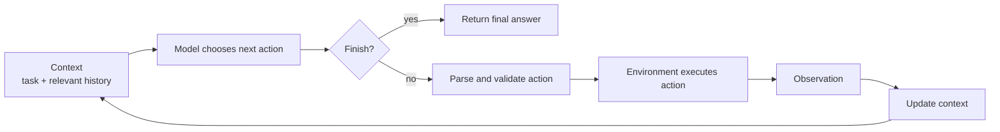
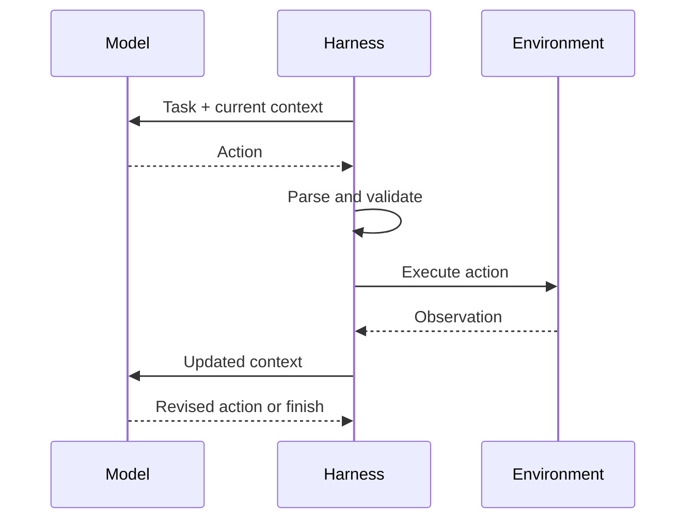
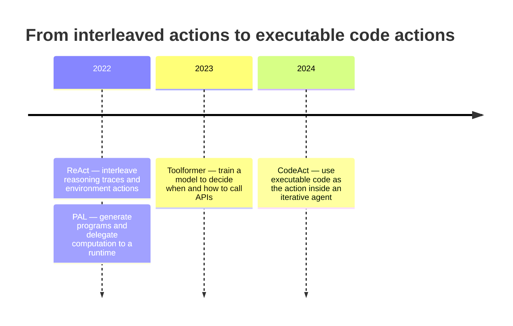

# Chapter 3 — The Reason–Act–Observe Loop

An agent rarely knows everything it needs at the start of a task. It must take
an action, inspect what happened, and decide what to do next.

```text
Reason: I need the value in a.txt.
Action: read_file("a.txt")
Observation: 42
Reason: Now I can use 42 to choose the next action.
```

That repeated feedback cycle is the foundation of an agent.

## 1. Concept

The **reason–act–observe loop** is a control loop in which a model:

1. uses the current context to choose a next action;
2. sends that action to an environment;
3. receives the environment's result as an observation;
4. repeats until it reaches a stopping condition.

ReAct is an influential prompting pattern that interleaves model-generated
reasoning traces with task-specific actions. This chapter uses its familiar
`Thought → Action → Observation` notation because it makes the loop easy to
inspect.

The notation is not a requirement. Production systems may keep reasoning
implicit, hidden, summarized, or represented as structured state. The essential
mechanism is **action followed by observation-driven revision**.

## 2. Why This Matters for Code-Executing Agents

Generated code is only a proposal until it runs. Execution supplies evidence:

- stdout and stderr;
- return values;
- changed files or state;
- exceptions and exit status.

The agent becomes useful when that evidence returns to the model and influences
the next action. A syntax error can lead to corrected code. An unexpected file
format can change the plan. A successful result can terminate the loop.

Without observation feedback, code generation is a one-shot pipeline. With it,
the system can adapt.

## 3. Mental Model

Treat the agent as a feedback controller, not as a long prompt.



One iteration transforms state:

```text
(current context, chosen action)
        ↓ environment
(observation, updated context)
```

Three rules keep this model precise:

- **Reason is a decision process, not ground truth.** A plausible explanation
  can still be wrong.
- **An observation is evidence, not success.** A command may run successfully
  while producing the wrong result.
- **Finish is an action.** The loop needs an explicit, testable way to stop.

## 4. Architecture (place in the loop / context)

A minimal loop has six responsibilities:

| Component | Responsibility |
|---|---|
| Context builder | Select the task, prior actions, and observations the model sees |
| Model | Propose an action or finish response |
| Parser | Convert model output into an executable request |
| Validator | Reject malformed or disallowed actions |
| Environment | Execute the action and capture its effects |
| Controller | Append the observation, enforce limits, and repeat or stop |



The model does not directly operate on the world. The harness mediates every
action and decides what observation re-enters context.

## 5. Detailed Explanation

### 5.1 Anatomy of one iteration

Consider this task:

> Which of `a.txt`, `b.txt`, and `c.txt` contains the largest integer, and what
> is that integer plus 10?

A ReAct-style trace may begin:

```text
Thought: I need the file values. Start with a.txt.
Action: read_file("a.txt")
Observation: 42
```

Each field has a different role:

- `Thought` records the model's current rationale in this teaching example.
- `Action` is the request the harness can parse and execute.
- `Observation` is produced by the environment, not invented by the model.

The next model call must include the observation, directly or through managed
state. Otherwise the model cannot reliably adapt to the result.

### 5.2 Context is the loop's working state

Models do not automatically share the harness's state. The controller must
construct the next input:

```python
context += (
    f"\nAction: {action.name}({action.argument!r})"
    f"\nObservation: {observation}"
)
```

This simple append-only strategy is adequate for a small example. Long-running
agents need selection, truncation, summarization, or external state because
unbounded transcripts become expensive and noisy. Later chapters address those
context-engineering choices.

An observation should contain enough information to guide the next decision,
but not every byte the environment produced. For a command, that often means
exit status, bounded stdout/stderr, duration, and a concise description of side
effects.

### 5.3 Multi-turn adaptation

Iteration matters when later actions depend on earlier results:

```text
read configuration
    ↓
choose parser based on file format
    ↓
run parser
    ↓
repair code if execution fails
    ↓
verify output and finish
```

A fixed workflow can handle known branches. A model-driven loop is useful when
the appropriate next action cannot be fully specified in advance. That
flexibility must be bounded with step, time, token, and effect limits.

### 5.4 ReAct and CodeAct share the loop

ReAct and CodeAct differ mainly in the action language.

**ReAct-shaped example**

```text
Action 1: read_file("a.txt") → 42
Action 2: read_file("b.txt") → 17
Action 3: read_file("c.txt") → 8
Finish: a.txt contains 42; 42 + 10 = 52
```

**CodeAct-shaped example**

```python
values = {
    path: int(read_file(path))
    for path in ["a.txt", "b.txt", "c.txt"]
}
largest = max(values, key=values.get)
print(largest, values[largest] + 10)
```

The CodeAct action bundles the reads and comparison, but it still produces an
observation. If the program fails or exposes new information, the loop can emit
another code action. CodeAct changes how much work fits inside one action; it
does not remove reason–act–observe iteration.

### 5.5 A failure that correct observations do not prevent

The runnable example includes two scripted six-file traces. Both receive the
same correct file values. One trace nevertheless claims that `55 < 42`, keeps
the wrong running maximum, and returns the wrong answer.

This demonstrates a narrow but important point:

> A loop can verify that an action executed and still fail because the model
> interpreted the observation incorrectly.

Code can reduce manual arithmetic or state tracking by delegating it to an
interpreter. It does not guarantee correctness. Generated code could use
`min()` instead of `max()`, parse a value incorrectly, or omit a file. The
advantage is that deterministic operations can be made explicit and tested.

The appropriate response is verification:

- assert expected properties;
- inspect important side effects;
- compare results through an independent check where practical;
- treat successful execution as evidence, not proof.

### 5.6 Termination

A loop must stop for one of three broad reasons:

1. **Success:** the model emits a valid finish action and required checks pass.
2. **Failure:** an error is unrecoverable or a retry policy is exhausted.
3. **Budget:** a step, time, token, or cost limit is reached.

“The model said it is done” is not always sufficient. For important tasks, the
harness should verify deliverables or postconditions before accepting finish.

### 5.7 Historical lineage

The relevant ideas developed along related but distinct paths:



- **ReAct** established a widely used pattern for interleaving reasoning and
  task-specific actions.
- **PAL** focused on program-aided reasoning: the model generates a program and
  delegates computation to an interpreter.
- **Toolformer** addressed a different question—learning when and how to invoke
  external APIs.
- **CodeAct** placed executable Python actions inside an iterative agent loop.

This is a conceptual lineage, not a claim that each work directly extends the
previous one.

## 6. Minimal Implementation

The core control flow can be expressed without committing to a provider:

```python
context = [task]

for step in range(max_steps):
    decision = model(context)

    if decision.is_finish:
        return validate_final_answer(decision.answer)

    action = parse_and_validate(decision.action)
    observation = environment.execute(action)
    context.append({"action": action, "observation": observation})

raise StepLimitExceeded(max_steps)
```

The chapter implementation uses a scripted model so the behavior is
deterministic:

```bash
source .venv/bin/activate
python chapters/ch03-reason-act-observe-loop/code/react_vs_codeact.py
```

[`code/react_vs_codeact.py`](code/react_vs_codeact.py) contains:

- a runnable ReAct-style loop with real in-memory tool calls;
- a CodeAct-style loop that executes a fixed code action;
- correct and flawed traces for the six-file failure demonstration;
- a compact historical timeline.

There is no live model call yet. Chapter 5 introduces one.

## 7. Hands-on Lab

Run [`notebooks/ch03_react_vs_codeact.ipynb`](notebooks/ch03_react_vs_codeact.ipynb).
It compares the two action shapes and exposes the incorrect-running-maximum
failure.

Then perform these experiments:

1. Remove observations from the accumulated context. Explain why the scripted
   model hides the resulting problem and how a live model would differ.
2. Change the code action from `max()` to `min()` and observe that successful
   execution does not imply correctness.
3. Add a postcondition that independently checks the selected maximum.
4. Set `max_steps` below the required number of ReAct actions and inspect the
   termination failure.

## 8. Failure Lab

The included flawed trace isolates an interpretation error:

```text
Observation: d.txt contains 55
Thought: 55 is less than 42, so the maximum remains 42
```

The environment is correct; the model state is not. The loop carries the error
forward because no postcondition checks the final answer.

Now consider three failures that can look similar externally:

| Symptom | Possible cause |
|---|---|
| Wrong final answer | Incorrect reasoning or incorrect generated code |
| Repeated action | Observation omitted, unclear, or ignored |
| Loop never finishes | Missing stop signal, parser mismatch, or ineffective recovery |

Full traces help distinguish them. Final answers alone do not.

## 9. Instrumentation (what to log / trace / measure)

For every iteration, record:

- run ID, step number, and timestamp;
- model request identifier and action;
- parser and validation result;
- tool/runtime start, duration, and status;
- bounded observation returned to context;
- context size before the next call;
- finish reason;
- side effects and verification result.

Avoid treating hidden reasoning as a required observability surface. Log the
decisions, actions, observations, and state transitions needed to reproduce and
debug behavior.

## 10. Design Considerations

- **Observation design:** Too little feedback prevents recovery; too much
  feedback consumes context and can distract the model.
- **State ownership:** Keep authoritative task state in the harness or
  environment rather than relying solely on prose history.
- **Validation:** Validate action shape before execution and outcomes before
  accepting completion.
- **Bounded autonomy:** Apply step, time, token, and effect budgets.
- **Idempotency:** Retried actions should not accidentally duplicate effects.
- **Determinism:** Scripted models are useful for testing loop mechanics, but
  they cannot demonstrate live-model quality.

## 11. Common Mistakes

- Calling any chain of model calls “ReAct” even when no observation changes the
  next decision.
- Assuming the model remembers an observation that was never returned in
  context or managed state.
- Treating a successful action as proof that the task succeeded.
- Assuming explicit thought text is required for an agent loop.
- Letting the model be the sole judge of completion.
- Omitting a maximum-step or timeout condition.
- Claiming that code eliminates reasoning errors rather than moving some
  operations into an executable, testable form.

## 12. Comparisons / Alternatives

| Pattern | Control | Best fit | Limitation |
|---|---|---|---|
| One-shot generation | Model responds once | Simple, fully specified tasks | Cannot adapt to execution results |
| Fixed workflow | Application owns all branches | Stable, repeatable processes | Cannot choose novel paths |
| ReAct-style loop | Model chooses among bounded actions | Interactive search and tool use | More turns; reasoning may misinterpret observations |
| CodeAct-style loop | Model emits composable code actions | Multi-step computation and tool composition | Broader execution and validation surface |
| Hybrid loop | Workflow governs stages; model chooses locally | Production systems needing flexibility and control | More design complexity |

## 13. Review Questions

1. Which parts of the loop are produced by the model, harness, and environment?
2. Why is an observation necessary but not sufficient for correctness?
3. What changes—and what stays the same—between ReAct and CodeAct?
4. Why does the scripted model fail to test whether context actually influences
   the next action?
5. Name three valid termination paths.
6. What information should a command-execution observation contain?
7. How would you verify a finish action for the three-file task?

## 14. Chapter Summary

An agent is a feedback loop: choose an action from current context, execute it,
observe the result, update state, and repeat. ReAct made the interleaving of
reasoning traces and actions explicit. CodeAct retains the loop but makes
executable code the action.

Observations enable adaptation, not automatic correctness. The harness must
manage state, validate actions, bound iteration, capture useful observations,
and verify completion. Those responsibilities—not the `Thought:` label—turn a
sequence of model calls into a reliable agent loop.

## 15. Chapter Deliverable

[`loop_lineage_diagram.md`](loop_lineage_diagram.md) contains the annotated
loop, side-by-side ReAct and CodeAct traces, and the conceptual lineage from
ReAct through program-aided and learned tool use to CodeAct.

## 16. Further Reading

- Yao et al., [*ReAct: Synergizing Reasoning and Acting in Language
  Models*](https://arxiv.org/abs/2210.03629) (ICLR 2023).
- Gao et al., [*PAL: Program-Aided Language
  Models*](https://arxiv.org/abs/2211.10435) (2022).
- Schick et al., [*Toolformer: Language Models Can Teach Themselves to Use
  Tools*](https://arxiv.org/abs/2302.04761) (2023).
- Wang et al., [*Executable Code Actions Elicit Better LLM
  Agents*](https://arxiv.org/abs/2402.01030) (ICML 2024).
