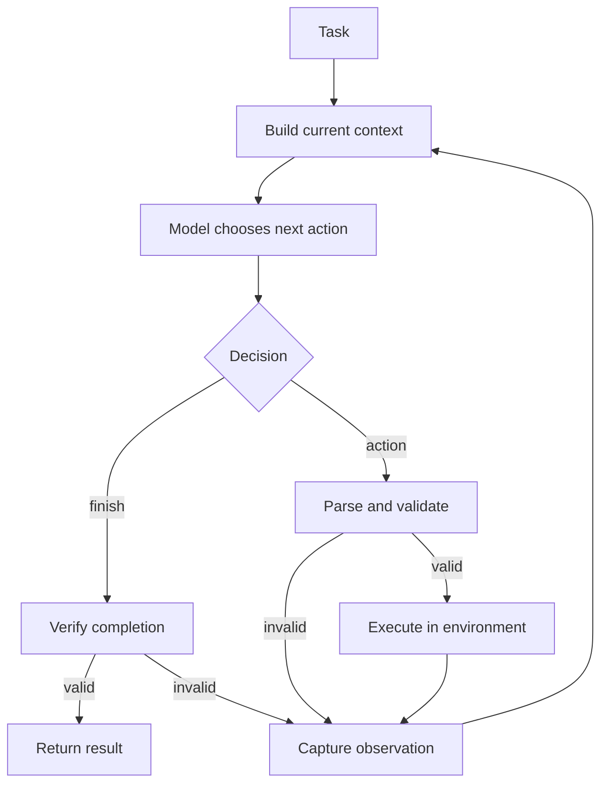
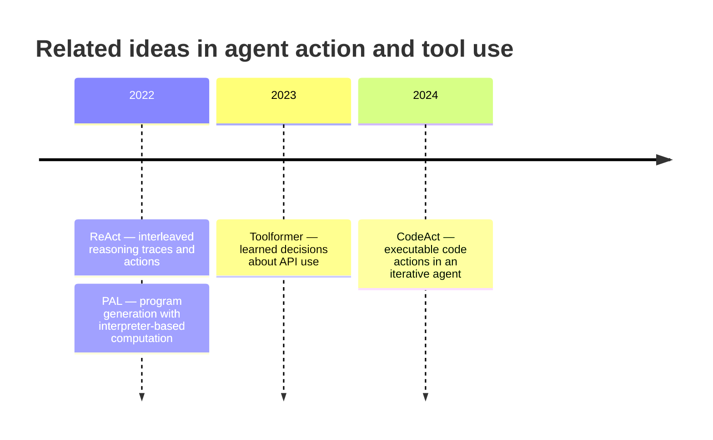

# Reason–Act–Observe: Loop and Lineage

This chapter deliverable is a compact reference for the feedback loop and the
shift from individual tool actions to executable code actions.

## 1. Annotated loop



| Stage | Owner | Key question |
|---|---|---|
| Reason/decision | Model | What should happen next? |
| Parse and validate | Harness | Is the request well-formed and allowed? |
| Act | Environment | What actually happened? |
| Observe | Harness | What evidence should return to context? |
| Finish | Model + harness | Is the task complete and verified? |

## 2. Same task, different action shapes

Task: find the largest integer in three files and add 10.

### ReAct-shaped trace

```text
Thought: Read a.txt first.
Action: read_file("a.txt")
Observation: 42

Thought: Read b.txt.
Action: read_file("b.txt")
Observation: 17

Thought: Read c.txt.
Action: read_file("c.txt")
Observation: 8

Finish: a.txt contains the maximum; 42 + 10 = 52
```

The model sees each result before selecting the next action.

### CodeAct-shaped trace

```text
Action:
    values = {
        path: int(read_file(path))
        for path in ["a.txt", "b.txt", "c.txt"]
    }
    largest = max(values, key=values.get)
    print(largest, values[largest] + 10)

Observation: a.txt 52
Finish: a.txt contains the maximum; 42 + 10 = 52
```

The loop remains intact, but one action contains several reads and a
calculation. If execution fails, the observation can drive another iteration.

## 3. What changes from ReAct to CodeAct?

| Property | ReAct-shaped example | CodeAct-shaped example |
|---|---|---|
| Loop | Reason → action → observation | Reason → action → observation |
| Action language | One named tool call | Executable program |
| Intermediate values | Returned through model context | Held in program variables |
| Composition | Across turns or in harness | Inside the action |
| Feedback | After each tool call | After code execution or explicit checkpoints |
| Main trade-off | More orchestration turns | Broader execution/failure surface |

The important continuity is observation-driven revision. CodeAct changes the
action space, not the fundamental loop.

## 4. Failure checkpoint

Correct observations do not guarantee a correct result:

```text
Observation: d.txt contains 55
Incorrect interpretation: 55 is less than the current maximum, 42
Final answer: a.txt contains the maximum
```

Likewise, code that executes without error may still contain the wrong
operation. Reliable loops verify outcomes rather than equating successful
execution with task success.

## 5. Conceptual lineage



| Work | Contribution relevant here | Important distinction |
|---|---|---|
| ReAct | Interleaves reasoning traces with task-specific actions | Defines the feedback pattern used in this chapter |
| PAL | Delegates generated-program computation to a runtime | Primarily generate-then-execute, not the same iterative loop |
| Toolformer | Trains a model to decide when and how to invoke APIs | Focuses on learning tool use, not code as action |
| CodeAct | Uses executable Python as a unified action space | Retains iterative revision from new observations |

This is a conceptual lineage. The works address overlapping questions but do
not form a single linear implementation history.

## 6. Implementation map

The reference implementation is
[`code/react_vs_codeact.py`](code/react_vs_codeact.py):

```text
ScriptedReActModel
    ↓ next ReActStep
run_react_loop
    ↓ validates tool name
read_file
    ↓ value
Observation appended to context
    ↓
next iteration or Finish
```

The model output is scripted for determinism. Tool calls and code execution are
real within an in-memory teaching environment.
