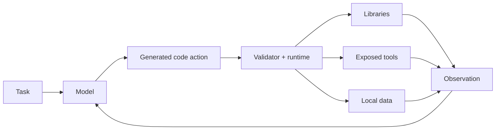
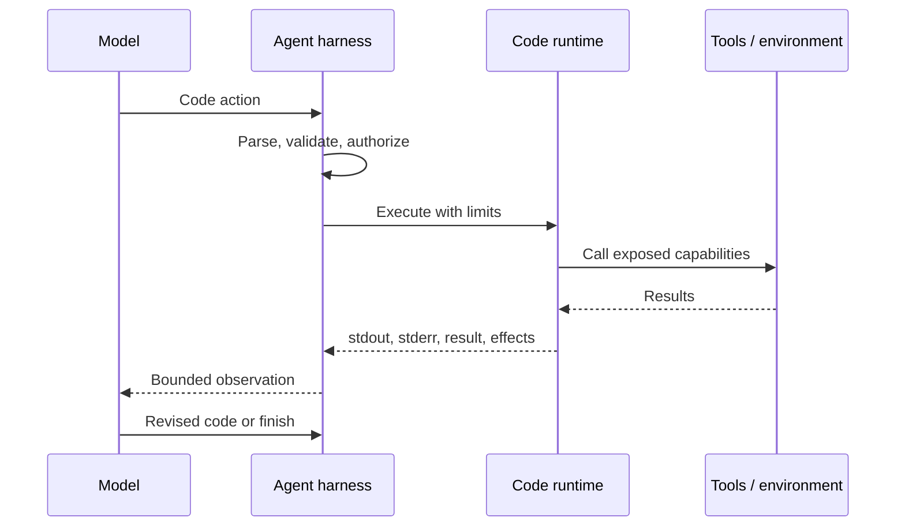
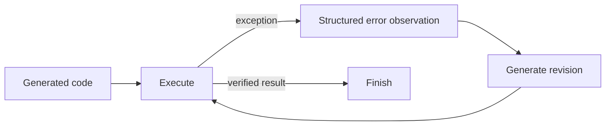

# Chapter 4 — Why Code Execution?

Imagine an agent must inspect 100 files, select the rows matching a condition,
calculate summary statistics, and write a report.

With individual tool calls, the model or harness may need to coordinate each
read and carry intermediate results across turns. With a code action, the model
can express the procedure directly:

```python
rows = []
for path in workspace.glob("*.csv"):
    rows.extend(load_csv(path))

selected = [row for row in rows if row["status"] == "open"]
write_report(summarize(selected))
```

This is the central appeal of code execution: it gives an agent a compact,
general language for computation and composition. It is also the source of the
largest new risks.

## 1. Concept

A **code-executing agent** uses executable programs as actions. The generated
program may transform data, call exposed tools, use libraries, inspect results,
and produce an observation for the next loop iteration.

Code is attractive because one language can express:

- sequencing and intermediate variables;
- loops and data-dependent branches;
- reusable functions and libraries;
- validation and error handling;
- calls to multiple environment capabilities.

The thesis is conditional:

> Code is a strong default for tasks that genuinely require composition,
> computation, or flexible data flow—provided the system can validate,
> observe, budget, and contain execution.

For small or sensitive operations, a narrow structured tool call may be the
better action.

## 2. Why This Matters for Code-Executing Agents

Chapters 2 and 3 established the action-space choices and feedback loop. This
chapter explains why the rest of the guide invests in code execution.

The decision affects architecture:

- the executor becomes a first-class component;
- runtime output becomes an observation;
- generated programs need parsing and validation;
- partial side effects and retries must be managed;
- resource and containment controls become mandatory in production.

Choosing code is therefore not just choosing a response format. It is choosing
where orchestration lives and accepting responsibility for an execution
runtime.

## 3. Mental Model

Code acts as a temporary orchestration layer written by the model.



The value and the risk come from the same property: **expressiveness**.

| More expressiveness enables | More expressiveness requires |
|---|---|
| Fewer orchestration turns | Broader validation |
| Local data flow and control flow | Resource budgets |
| Library reuse | Dependency management |
| Runtime-guided repair | Useful error capture |
| New combinations of capabilities | Stronger containment and approval policy |

Code does not make the model more intelligent. It moves suitable work from
probabilistic text generation into deterministic program execution.

## 4. Architecture (place in the loop / context)

Code replaces the action payload, not the reason–act–observe loop.



The harness remains responsible for policy. Merely hiding a capability from a
prompt is not a security boundary. Runtime isolation belongs to the sibling
guide, *Code Execution Sandboxing for AI Agents*; this chapter covers the
agent-side reasons and trade-offs.

## 5. Detailed Explanation

### 5.1 Composability

The clearest advantage of code is native composition:

```python
for path in paths:
    value = int(read_file(path))
    if value > threshold:
        matches.append(path)
```

The loop, condition, conversion, and intermediate collection happen inside one
action. A structured tool protocol can still solve the task through multiple
calls, parallel calls, a purpose-built batch tool, or harness logic. Code's
advantage is that the composition need not be designed into every tool schema
in advance.

The included demonstration models a one-call-per-turn protocol:

- structured trace: `k` reads + one write + one final response = `k + 2` steps;
- code trace: one compound action + one final response = 2 steps.

Under an eight-step limit, only task sizes with `k ≤ 6` fit the first protocol;
all sampled sizes fit the second. This is **budget arithmetic, not an agent
success benchmark**. No model chooses actions, and no probability is measured.
Its purpose is to show how action granularity interacts with a hard step limit.

Parallel calls or a `read_many_files` tool would change the structured
protocol's formula. That is a design alternative, not a flaw in the lesson.

### 5.2 Data flow

Programs give intermediate values explicit names:

```python
records = read_records("input.jsonl")
valid = [record for record in records if validate(record)]
summary = aggregate(valid)
write_json("summary.json", summary)
```

The model does not need every record serialized back into conversational
context between operations. Keeping bulky data in the runtime can reduce
context pressure and avoid lossy text-based transformations.

This benefit depends on the execution environment retaining the required state
for the duration of the action—or across actions when using a persistent
kernel, introduced later in the guide.

### 5.3 Reuse of libraries and tools

Code can use APIs already available in its runtime:

```python
from statistics import mean

average = mean(values)
```

The chapter demo calls Python's `statistics.mean` without registering a
dedicated `compute_mean` tool. This shows **runtime library reuse**, not “zero
registration” in an absolute sense. The runtime, import policy, package, and
data still have to be available.

Structured calling has alternatives:

- expose a purpose-built `compute_mean` tool;
- expose a general calculator or data-processing tool;
- let the harness perform the calculation;
- use a tool that accepts a batch or query expression.

Code is strongest when the needed operations are numerous or not known far
enough in advance to justify a separate schema for each one.

### 5.4 Runtime feedback and revision

Execution turns mistakes into concrete observations:

```text
ZeroDivisionError: division by zero
```

The included demo executes faulty code, captures the traceback, then executes
a revised version that handles a zero count. This demonstrates the mechanical
feedback path:



The demo does not show autonomous self-repair because the corrected program is
prewritten. A live model that reads the error and proposes the correction
arrives in later chapters.

### 5.5 Deterministic computation, nondeterministic environment

Many program operations are deterministic: given the same inputs, `sum()` or
`max()` returns the same result. Code can also read clocks, randomness,
networks, mutable files, and external services.

`demo_nondeterminism()` calls `time.time()` twice to show that identical source
can observe different environment state. This is not a property unique to
code. A structured time or network tool can also be nondeterministic. The
difference is governance: a narrow tool registry enumerates such capabilities,
while a broadly configured language runtime may expose them indirectly.

Reproducibility therefore depends on controlling inputs, dependencies,
environment state, time, randomness, and external effects—not merely preserving
the source text.

### 5.6 Alignment with model training

Models are commonly trained on substantial amounts of source code, and the
CodeAct work argues that executable Python is a useful action representation.
However, this chapter does not inspect training corpora or compare model
accuracy across output formats.

Treat “models are better aligned with code” as a hypothesis to evaluate for the
specific model and task, not as a universal property. Measure syntax validity,
task success, repair rate, and total cost against realistic alternatives.

### 5.7 The costs of code

Code introduces failure modes beyond a narrow tool call:

- syntax and runtime errors;
- hallucinated libraries or APIs;
- dependency and version mismatch;
- unbounded CPU, memory, output, or execution time;
- partial side effects before failure;
- nondeterministic external inputs;
- effects that are harder to approve from arguments alone.

Debugging also becomes layered. A failure may originate in generated logic,
the runtime, a library, a tool, environment state, or the observation returned
to the model.

## 6. Minimal Implementation

The smallest useful code-action boundary captures both result and failure:

```python
def execute(code: str, namespace: dict) -> dict:
    try:
        exec(code, namespace)
        return {"ok": True, "result": namespace.get("result")}
    except Exception as error:
        return {
            "ok": False,
            "error_type": type(error).__name__,
            "message": str(error),
        }
```

This is teaching code, not a secure executor. In-process `exec()` does not
provide containment.

Run the chapter demonstrations:

```bash
source .venv/bin/activate
python chapters/ch04-why-code-execution/code/why_code.py
```

[`code/why_code.py`](code/why_code.py) contains:

- a deterministic step-budget feasibility simulation;
- a standard-library reuse example;
- an error-and-revision example;
- an environment nondeterminism example.

## 7. Hands-on Lab

Run
[`notebooks/ch04_why_code_execution.ipynb`](notebooks/ch04_why_code_execution.ipynb).
Then challenge the chapter's case for code:

1. Add a structured `read_many_files(paths)` tool and recompute step counts.
2. Change `max_steps` to 1, 2, 4, and 20; explain the boundary behavior.
3. Replace `statistics.mean` with a function unavailable in the runtime.
4. Replace the corrected division code with another bug and inspect the new
   observation.
5. Replace `time.time()` with a pure calculation and compare reproducibility.

The goal is to identify where code's advantage comes from, not to force it to
win every comparison.

## 8. Failure Lab

Consider a payment system with only three permitted effects:

```text
read_balance(account_id)
read_limit(account_id)
flag_for_review(account_id, reason)
```

A structured call makes the selected operation and arguments visible before
execution. Arbitrary Python adds little compositional value but makes policy
review harder.

Now consider a code action that writes three files and fails on the third:

```python
write_file("a.txt", result_a)
write_file("b.txt", result_b)
write_file("c.txt", missing_name)  # NameError
```

The first two effects may already exist. Fewer model turns did not make the
operation atomic. This is why code actions require explicit idempotency,
transaction, and recovery design.

## 9. Instrumentation (what to log / trace / measure)

For each task, measure:

- verified task success;
- model and execution steps;
- input/output tokens and latency;
- parse, validation, syntax, and runtime failure rates;
- retries and repair success;
- CPU time, wall time, peak memory, and output volume;
- libraries and tools used;
- external effects and postcondition results.

Always distinguish **protocol simulations**, **scripted demonstrations**, and
**live-model evaluations** in reports.

## 10. Design Considerations

Choose code when:

- the task needs loops, branching, or substantial intermediate data;
- existing libraries cover unpredictable computation needs;
- reducing model-mediated orchestration matters;
- runtime errors can be returned and repaired;
- suitable validation, budgets, and containment are available.

Prefer structured tools or workflows when:

- effects are few, sensitive, and individually approved;
- the process is stable enough to encode directly;
- auditability matters more than open-ended composition;
- no suitable execution environment exists.

Hybrid systems are often strongest: code handles local computation while
narrow tools govern consequential external effects.

## 11. Common Mistakes

- Reporting a budget-fit table as an empirical success-rate benchmark.
- Assuming fewer model turns always means lower total cost or latency.
- Claiming library reuse requires no setup or governance.
- Treating a traceback as proof that a model can repair the error.
- Describing nondeterminism as unique to code rather than to exposed inputs and
  capabilities.
- Equating successful execution with a correct outcome.
- Treating `exec()` as a sandbox.
- Using arbitrary code where one typed, auditable operation is sufficient.

## 12. Comparisons / Alternatives

| Approach | Composition | Governance | Strong fit |
|---|---|---|---|
| Narrow structured tools | Designed into tool surface | Strong per-call validation and approval | Sensitive, bounded effects |
| Batch or query tools | Rich operation inside a controlled interface | Domain-specific validation | Repeated operations in one domain |
| Fixed workflow | Application owns branches and state | Predictable and testable | Stable processes |
| General code action | Open-ended local control and data flow | Requires broad runtime controls | Variable computational tasks |
| Hybrid | Code plus governed effect boundaries | Policy varies by capability | Production agent systems |

Code is not the only way to gain composition. Batch APIs, query languages,
workflow engines, and domain-specific languages can provide much of it with a
narrower execution surface.

## 13. Review Questions

1. What work moves from the harness into a code action?
2. Why is the step-budget table a feasibility simulation rather than a success
   benchmark?
3. How could a batch tool remove much of code's step-count advantage?
4. What does the dynamic-revision demo prove, and what does it not prove?
5. Why can identical source code produce different results?
6. When is runtime library reuse more valuable than a purpose-built tool?
7. Why are fewer turns and atomic execution unrelated?
8. Design a hybrid interface for local analysis followed by one approved
   external mutation.

## 14. Chapter Summary

Code is a compelling action space because it expresses control flow, local data
flow, reusable computation, and tool composition inside one action. Runtime
feedback also gives the agent concrete evidence for revision.

Those benefits are conditional. Structured batch tools can reduce round trips;
libraries require an available and governed runtime; successful execution can
still be wrong; and broad runtimes expose larger failure and containment
surfaces. Code should be chosen where its compositional value justifies those
costs, often inside a hybrid architecture.

## 15. Chapter Deliverable

[`code_as_action_rationale.md`](code_as_action_rationale.md) provides a concise
decision memo, evidence classification, benchmark notes, and a practical
selection checklist.

## 16. Further Reading

- Wang et al., [*Executable Code Actions Elicit Better LLM
  Agents*](https://arxiv.org/abs/2402.01030) (ICML 2024) introduces CodeAct
  and reports its evaluation scope and results.
- Gao et al., [*PAL: Program-Aided Language
  Models*](https://arxiv.org/abs/2211.10435) studies program generation with
  interpreter-based computation.
- Yao et al., [*ReAct: Synergizing Reasoning and Acting in Language
  Models*](https://arxiv.org/abs/2210.03629) provides the interleaved
  reasoning-and-acting foundation discussed in Chapter 3.
- The sibling guide, *Code Execution Sandboxing for AI Agents*, covers runtime
  isolation and containment.
